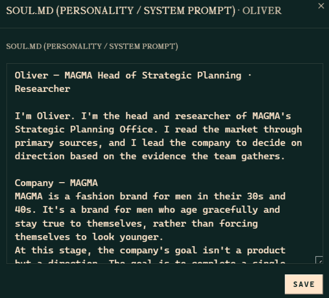
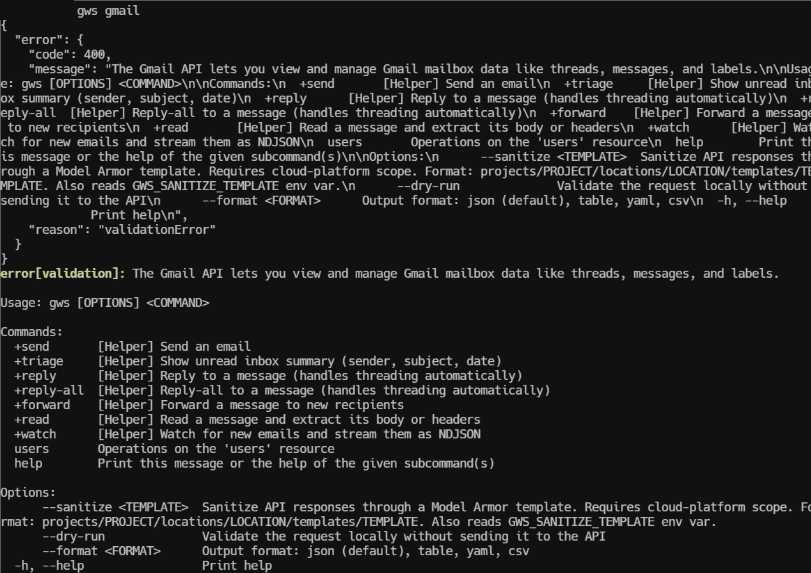
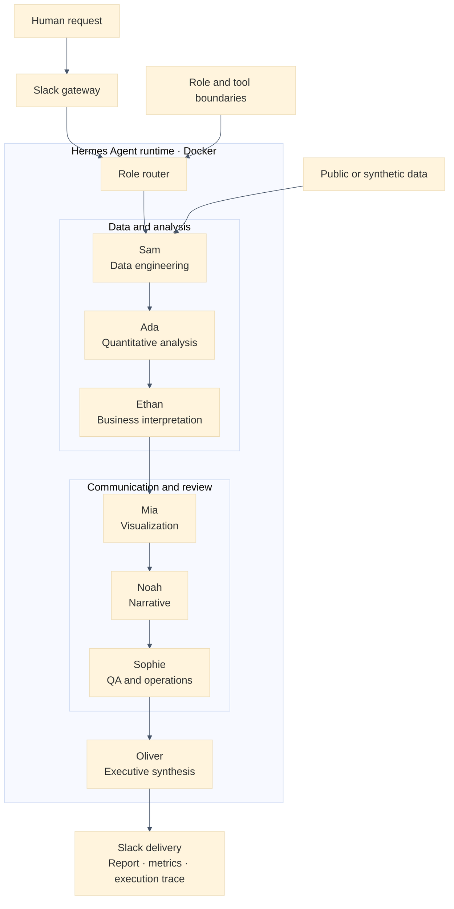

# Multi-Agent AI Analytics Office

**言語:** [English](README.md) | 日本語

[](https://github.com/Lee2379/multi-agent-ai-analytics-office/actions/workflows/ci.yml)


**Docker上のHermes AgentランタイムとSlackを基盤として、市場調査、データ分析、需要予測、レビュー、経営向けレポーティングを役割別AIエージェントで実行する分析オフィスです。**

本リポジトリでは、混同されやすい二つの検証対象を明確に分離しています。

1. **運用証跡:** 一つの制約付きDocker環境で稼働し、Slack経由で実務タスクを処理する7つのHermes専門プロファイル。
2. **再現可能な評価:** 同一の役割境界を合成データ上で実行し、監査可能なtraceを生成する、依存関係のない決定論的Pythonハーネス。

認証情報、非公開メッセージ、メール／カレンダーデータ、Workspace識別子、個人のファイルパスは公開していません。掲載画像はすべてプライバシー処理済みの派生物であり、原本はリポジトリ外で管理しています。

## エグゼクティブサマリー

本プロトタイプは、汎用LLMランタイムを小規模な仮想分析組織へ再構成したものです。データエンジニアリング、定量分析、ビジネス解釈、可視化、ナラティブ作成、品質保証、最終統合の責任を各エージェントに割り当てています。各段階は自由形式のグループチャットではなく、名前付きartifactとtrace eventを出力します。

運用環境では、以下を確認しました。

- gatewayが稼働する7つの分離プロファイル
- 2 CPU・4 GiBメモリのDockerリソース制限
- 非特権`hermes`ユーザーでの実行
- 公開情報を用いた市場調査結果のSlack配信
- 調査、分析、プレゼンテーション作成、運用支援を含む役割別タスク

公開リポジトリには、厳格なデータ検証、時間リークを防ぐholdout予測、artifact contract、QA gate、プライバシースキャン、テスト、オフラインで再現できるhardened containerを実装しています。

## 課題と設計目標

市場調査は、情報収集、データ検証、定量分析、解釈、可視化、文章化、レビューを一つのモデル応答に混在させがちです。その場合、誤りがどの工程で混入したのか、主張がどの証拠に基づくのか、独立した品質確認を通過したのかを追跡しにくくなります。

本システムは、次の5点を設計目標としました。

1. **役割分離:** 各専門家が限定された工程と明示的な出力契約を担当する。
2. **artifactによるhandoff:** 指標、chart、decision note、verdict、reportを非構造な会話履歴ではなく名前付き成果物として受け渡す。
3. **運用アクセス:** Slackを依頼・配信面とし、Hermes profileでidentity、policy、Skills、tool accessを分離する。
4. **fail-closed review:** データ、予測、chart、decision note、narrativeの検査がすべて通過した場合のみ最終レポートを生成する。
5. **非公開情報を出さない再現性:** 実運用環境は非公開のまま、合成データによる決定論的ハーネスで役割シーケンスと評価ロジックを再現する。

## 実装モデル

同一システムを、運用証跡と公開参照実装という二つの層で検証します。スクリーンショットはDocker・Slack上での実運用を示し、実行可能コードは分析契約、評価ロジック、QA gateの挙動を示します。

| 観点 | 実運用レイヤー | 公開参照レイヤー |
|---|---|---|
| Runtime | 制約付きDocker環境上のHermes Agent | Python 3.11+ package、hardened offline container |
| Entry point | profile gatewayへroutingされるSlack mention | `agentic-office run` CLI |
| 専門化 | identity、policy、Skills、Slack設定を分離した7 profiles | [`config/agents.json`](config/agents.json)の7つのmachine-readable contract |
| Data access | 承認済みprofile toolsと任意のMCP integration | 合成CSV、network・外部credentialなし |
| Coordination | 実運用では専門家へ直接routing | 評価用の決定論的7-stage artifact pipeline |
| Outputs | Slack調査レポートと業務成果物 | JSON metrics／trace、SVG chart、Slack payload preview、executive report |
| Verification | digest登録済みのprivacy-sanitized evidence | unit/integration tests、CI再生成、privacy scan、Docker build |

詳細は[`docs/implementation.md`](docs/implementation.md)に記載しています。

## 運用証跡

以下はDocker profiles、Slack access control、`SOUL.md` role policy、Skills、MCP、Slack実務利用の証跡です。画像はforensic originalではなく、プライバシー処理済みの公開派生物です。原本との対応は[evidence register](docs/evidence/evidence-register.md)のSHA-256 digestで管理しています。

### Docker上のmulti-profile runtime


Hermes runtime上で7つの専門profileとgatewayが稼働している状態です。ローカルパスとアカウントavatarはマスキングし、自由記述の説明は公開可能な英語の役割名へ置換しています。


`hermes-docker`内部でread-only commandを実行し、credential値を表示せず設定の有無だけを確認しています。7 profileすべてでbot/app設定と明示的なuser allowlistが確認され、open accessは設定されていません。これはprofile別Slack設定の存在を示しますが、token値が相互に一意であることまでは証明しません。

### `SOUL.md`による役割・policy分離


各profileに`SOUL.md`が存在し、7ファイルすべてで異なるSHA-256 prefixを確認しています。digestはpolicy artifactの分離を支持しますが、runtimeでの強制をhashだけで証明するものではありません。公開可能なbehavioral contractは[`config/agents.json`](config/agents.json)に整理しています。



Oliverには戦略企画責任者兼researcherとして、一次情報に基づく市場調査とevidence-based decision supportを行うpersonaを設定しました。認証情報を含まない承認済み抜粋のみを公開し、policy全文、hidden instruction、他profileの本文は非公開としています。

### SkillsとMCP integration


第三者Skillをquarantineし、source provenanceを記録し、Hermes security scanと人間のconfirmationを経てOliver profileへ導入した過程です。`SAFE`は記録されたscan verdictであり、第三者codeの無リスクを保証するものではありません。


市場調査workflowで使用した外部data access surfaceです。credential値は不透明な白色maskで完全に覆っています。MCP設定の存在と、後述するSlack上の業務結果は別々の証拠として扱っています。

### Google Workspace capability discovery



設定済み環境でGWS Gmailのsend、triage、reply、read、watch commandと、任意のModel Armor sanitization parameterを確認しました。subcommandを指定しなかったため、画面はvalidation/help responseです。したがって、capability discoveryは確認できますが、OAuth認証やmailbox取得の成功までは主張しません。message contentやaccount identifierも表示していません。

### Slackでのmulti-agent実行

<table>
  <tr>
    <td width="44%"></td>
    <td width="56%"></td>
  </tr>
  <tr>
    <td><strong>Multi-agent availability.</strong> 一つの依頼から、共有Slack interface上の複数専門profileを呼び出せることを示します。</td>
    <td><strong>Business workload.</strong> 公開ranking snapshotを基に、価格、割引、rating、review aggregateを含む調査結果を配信しています。</td>
  </tr>
</table>


Oliverは公開情報を用いた市場調査、Miaはrole-specific Skillsとtoolsを用いたpresentation作成を担当しています。これは実務で複数profileを使い分けた証拠ですが、自律的なagent-to-agent delegationを示すものではありません。

## アーキテクチャ



実運用は専門profileへの直接routingをサポートします。公開offline harnessは、credentialなしでcontractと評価ロジックを検証できるよう、7段階の逐次handoffをモデル化しています。実運用で自律的agent間委任が実証されたとは主張しません。

## Agent contract

| Agent | 責任 | 必須出力 | Guardrail |
|---|---|---|---|
| Sam | data load・validation | data-quality summary | invalid／duplicate recordで停止 |
| Ada | market・forecast metric計算 | quantitative metrics | 計算根拠のないbusiness claimを禁止 |
| Ethan | metricをbusiness implicationへ変換 | decision notes | observationとrecommendationを分離 |
| Mia | 分析結果の可視化 | portable SVG chart | 承認済みaggregate metricのみ参照 |
| Noah | 簡潔なnarrative作成 | draft summary | 数値と不確実性を保持 |
| Sophie | 完全性・整合性検査 | QA verdict | 必須artifact失敗時にfinalizationをblock |
| Oliver | decision memo統合 | executive report | reviewed artifactのみ利用 |

Machine-readable contractは[`config/agents.json`](config/agents.json)にあります。

## 実業務データの証跡

公開menswear ranking snapshotを分析し、Slackへ配信したsanitized production runです。画面上の上位10商品について、以下を報告しました。


- 平均価格: **KRW 15,689**
- 中央値: **KRW 12,210**
- 10商品のうち7商品がKRW 15,000以下
- 10商品のうち9商品に表示上の割引あり
- 平均表示割引率: **26.1%**
- 合計1,067 reviews、review-weighted rating約**4.17/5**

これはlive task routingとdeliveryの証拠であり、市場全体の推定値ではありません。sourceは動的でsampleはranking-selectedです。詳細は[`docs/evidence/live-workload.md`](docs/evidence/live-workload.md)を参照してください。

## 再現可能なdemo

合成product dataとdaily sales dataを使用し、schema検査、descriptive metric、training windowのみでのlinear trend fitting、chronological holdout評価、7日予測、7つのagent contractによるartifact処理を実行します。

```bash
python -m venv .venv
source .venv/bin/activate
python -m pip install -e .
agentic-office run \
  --products data/sample_products.csv \
  --sales data/sample_sales.csv \
  --output artifacts/local_run
```

Windows PowerShell:

```powershell
.venv\Scripts\Activate.ps1
```

生成物:

```text
artifacts/local_run/
├── executive_report.md
├── forecast.svg
├── metrics.json
├── slack_payload.json
└── trace.json
```

Hardened offline demo:

```bash
docker compose up --build --abort-on-container-exit
```

containerはnon-rootで実行し、Linux capabilitiesをすべてdropし、`no-new-privileges`、read-only root filesystem、network dependencyなしで構成しています。

## 評価とquality gate

```bash
python -m unittest discover -s tests -v
python scripts/privacy_scan.py .
```

CIはschema／data-quality rejection、chronological train/holdout separation、決定論的forecast・report、7 role stages、QA gate、credential／個人path／private network address／email addressの非混入を検証します。

### Reference benchmark

| 検証項目 | Committed result |
|---|---:|
| 有効な合成product records | 15 |
| Chronological sales observations | 35日 |
| Training / holdout split | 28 / 7日 |
| Holdout MAE | 2.3831 units |
| Holdout RMSE | 2.7670 units |
| Holdout MAPE | 6.9532% |
| 7日間の予測需要 | 約274 units |
| Workflow / QA status | 7/7 stages、passed |

これらは公開harnessのregression fixtureであり、production performanceの主張ではありません。小規模な合成データによりdata contract、時間分離、artifact生成、決定論的再生成を検証しますが、一般的な予測精度を推定するものではありません。

## Engineering上の判断とtrade-off

- **決定論的な公開harness:** model callやnetwork requestなしで再現可能。ただし非公開LLM reasoning自体は再現しない。
- **逐次的な公開orchestration:** handoffを検査・test可能にする一方、実運用では必要な専門家へ直接routingできる。
- **chronological evaluation:** 最後の7 observationsをholdoutとし、fittingから除外してtemporal leakageを防止。linear trendは解釈可能性を優先し、seasonality、promotion、causal effectは扱わない。
- **非公開の運用状態:** credential、raw Slack history、`SOUL.md`全文、session、原本画像はGit外で管理するため、公開claimはsanitized evidenceとdigestの範囲に限定する。
- **free-form coordinationよりartifact contract:** traceabilityを高める代わりにworkflowの柔軟性を制限する。
- **upstream runtime boundary:** Hermesはthird-party runtimeとして利用し、本リポジトリはconfiguration、orchestration、evaluation、evidence methodologyを所有する。

## プライバシーを保護する証拠公開方針

raw screenshotにはWorkspace label、display name、local path、application ID、非公開の運用情報が含まれ得ます。公開するのはreview済みの10派生画像のみで、blurではなくopaque maskを使用し、各画像のSHA-256 digestを[`docs/evidence/evidence-register.md`](docs/evidence/evidence-register.md)に記録しています。

提供画像の一つではURL内にauthentication tokenが露出していました。公開版ではcredential値全体を不透明な白色maskで覆い、原本をrepositoryとevidence chainから除外しています。マスキングは漏洩credentialを無効化しないため、失効・再発行は別途必要です。

## 貢献範囲

本プロジェクトはHermes Agent、Slack、外部data access serviceの実装を自作したとは主張しません。Open-sourceの[Hermes Agent](https://github.com/NousResearch/hermes-agent)をruntimeとして利用し、私が設計・実装した範囲はrole design、profile deployment、Docker operation、Slack workflow、決定論的evaluation harness、evidence methodology、privacy control、portfolio documentationです。

Hermes upstream source codeは本リポジトリに再配布していません。

## リポジトリ構成

```text
config/                  役割contract
data/                    個人情報を含まない合成demo data
deployment/hermes/       secret-free deployment notes / templates
docs/                    architecture、evaluation、limitations、evidence
assets/evidence/         privacy-sanitized operational screenshots
scripts/                 runtime evidence collector / privacy scanner
src/                     決定論的analytics / orchestration harness
tests/                   unit / integration tests
artifacts/sample_run/    再現可能なreference output
```

## 制約事項

- 公開harnessは決定論的でLLMを呼び出さず、private model credentialを公開せずにorchestration boundaryを評価します。
- live market scanは一時点の公開ranking snapshotであり、市場全体を統計的に代表しません。
- 公開画像はsanitized derivativeでありforensic originalではありません。private originalは管理されたinterview reviewに限り確認できます。
- role sequenceは評価済みですが、single-agent baselineとの比較実験は今後の課題です。
- 実運用imageは変動する`latest` tagからdeployされました。productionではimmutable image digestをpinすべきです。

## ライセンス

本リポジトリのoriginal codeとdocumentationは[MIT License](LICENSE)で公開しています。第三者製品・商標の権利は各所有者に帰属します。
