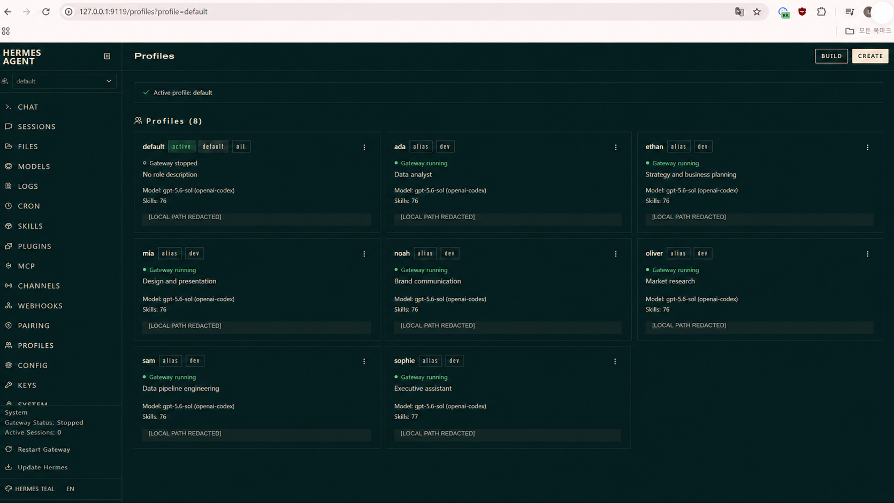
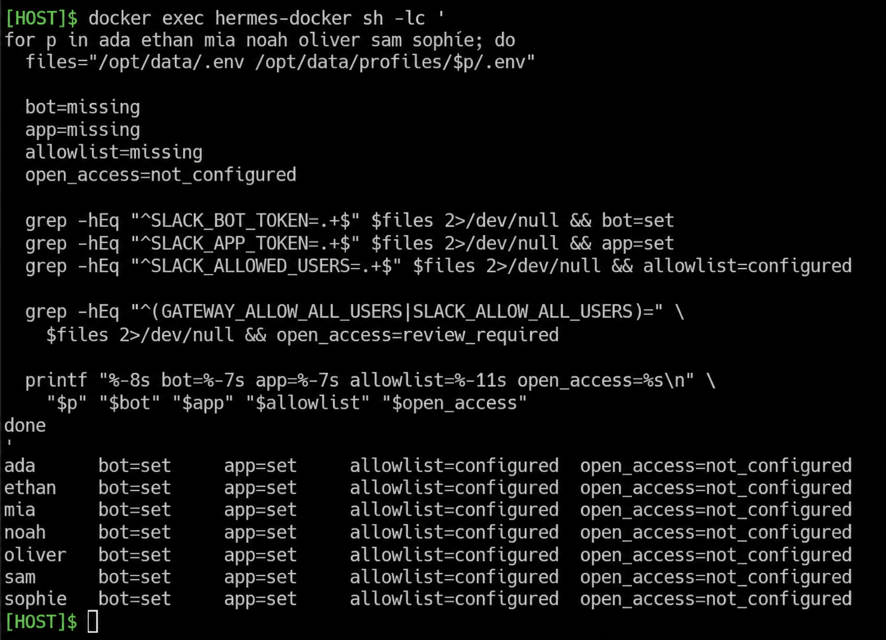
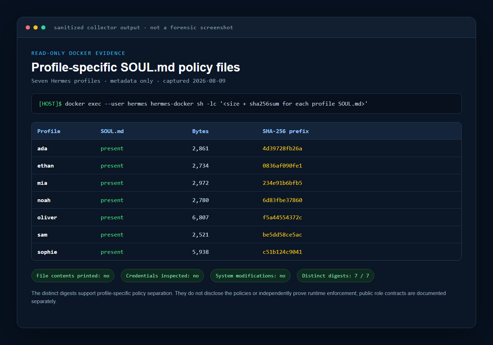
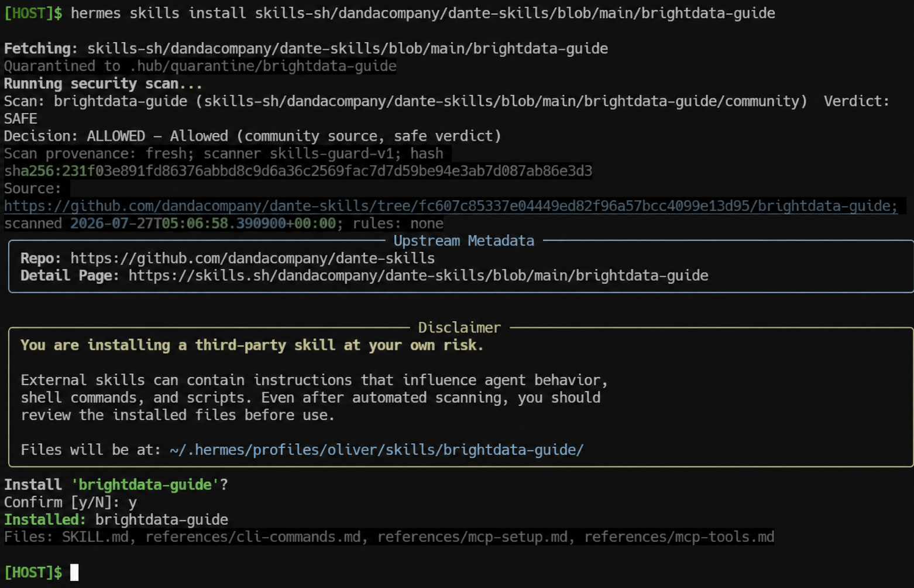
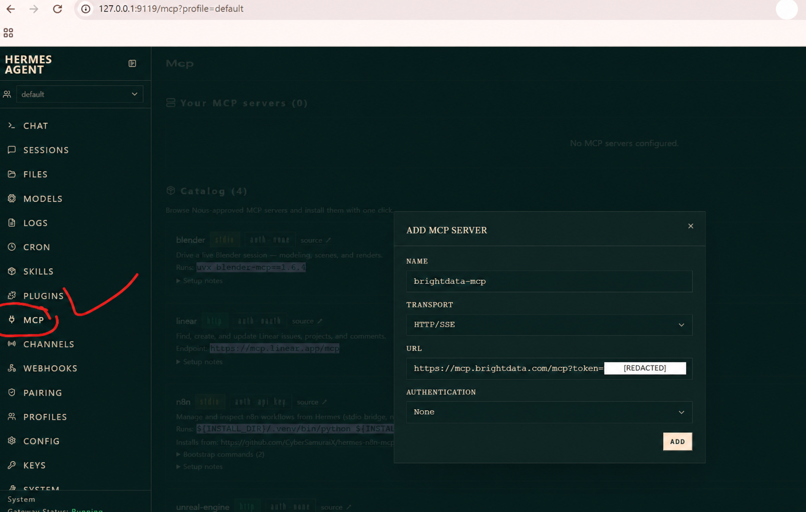
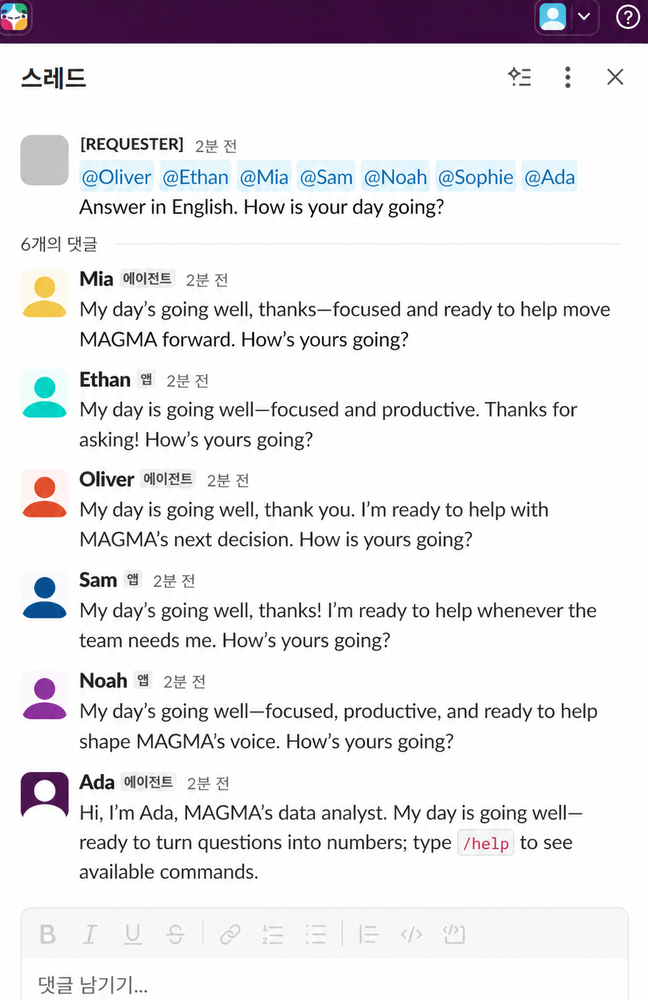
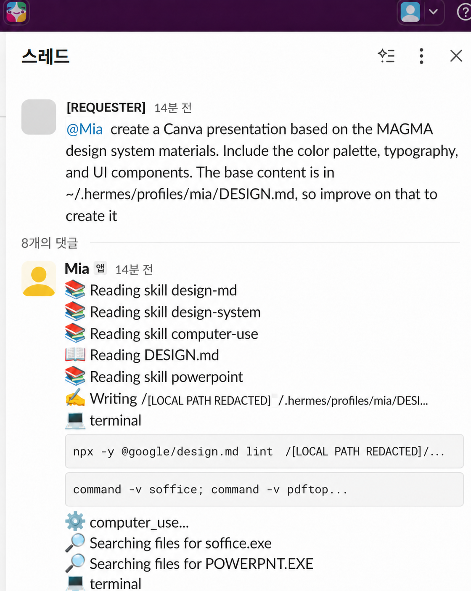
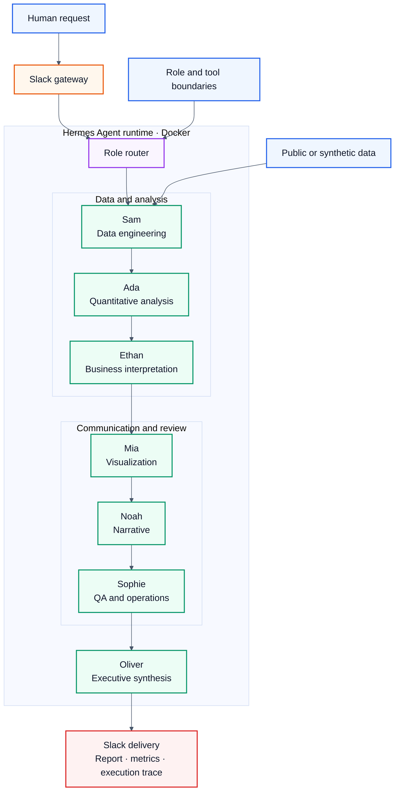
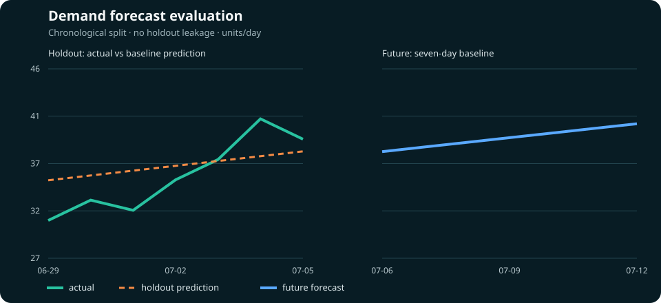

# Agentic Analytics Office

[](https://github.com/Lee2379/agentic-analytics-office/actions/workflows/ci.yml)


**A role-based AI office for market research, data analysis, forecasting, review, and executive reporting—operated through Slack on the Hermes Agent runtime in Docker.**

This portfolio case study separates two things that are often mixed together:

1. **Operational evidence:** seven specialized Hermes profiles running in one bounded Docker deployment and serving work through Slack.
2. **Reproducible evaluation:** a deterministic, dependency-free Python harness that exercises the same role boundaries on synthetic data, produces an auditable trace, and is tested in CI.

No credentials, private messages, email/calendar data, workspace identifiers, or personal filesystem paths are published. Selected screenshots appear only as privacy-sanitized derivatives; the original private artifacts remain outside the repository.

## Executive summary

The prototype turns a general-purpose LLM runtime into a small virtual analytics office. A request is routed to agents with explicit responsibilities: data engineering, quantitative analysis, business interpretation, visualization, narrative, quality review, and final synthesis. Each stage emits a named artifact and a trace event instead of relying on an opaque group chat.

The live deployment demonstrated:

- seven isolated agent profiles with running gateways;
- Docker resource limits of 2 CPUs and 4 GiB memory;
- execution as the unprivileged `hermes` user;
- Slack delivery of a public-source market scan;
- role-specific work, including research, analysis, presentation generation, and operations support.

The public repository adds the missing engineering layer: deterministic data validation, leakage-safe holdout forecasting, artifact contracts, a QA gate, privacy scanning, tests, and a hardened offline container.

## Operational evidence

The following evidence is organized by implementation layer: Docker profiles, Slack access controls, `SOUL.md` role policies, Skills, MCP, and live Slack work. The images are privacy-sanitized derivatives, not forensic originals. The underlying originals remain private and are linked to this case study by SHA-256 digest in the [evidence register](docs/evidence/evidence-register.md).

### Dockerized multi-profile runtime



The runtime registry shows seven named specialist profiles with active gateways inside the Hermes deployment. Local paths and the account avatar are masked; free-form descriptions are normalized to public role labels.



The read-only command executes inside `hermes-docker` and reports configuration presence without printing credential values. All seven profiles report bot/app configuration and an explicit user allowlist; open access is not configured. This supports profile-specific Slack configuration, but does not prove that the underlying token values are unique.

### `SOUL.md` role-policy separation



Each live profile has a `SOUL.md` file, and all seven files have distinct SHA-256 prefixes. No policy body is published. The digests support separate policy artifacts; the public behavioral contracts are documented in [`config/agents.json`](config/agents.json), and enforcement remains a runtime claim rather than something the hashes alone can prove.

### Skills and MCP integration



The Skills workflow quarantines a third-party package, records source provenance, runs the Hermes security scan, shows the human confirmation step, and installs the reviewed files into the Oliver profile. A `SAFE` verdict is evidence of the recorded scan result, not a guarantee that third-party code is risk-free.



The MCP screen shows the data-access integration surface used by the research workflow. The original credential value is completely covered by an opaque white mask. The live Slack report below is the separate evidence that a public-source research task produced a business result.

### Slack execution

<table>
  <tr>
    <td width="44%"></td>
    <td width="56%"></td>
  </tr>
  <tr>
    <td><strong>Multi-agent availability.</strong> A single request addresses the deployed specialist profiles in the shared Slack interface.</td>
    <td><strong>Business workload.</strong> A research specialist returns sourced pricing, discount, rating, and review aggregates from a live public ranking snapshot.</td>
  </tr>
</table>



The two work captures show different specialists used for different assignments: Oliver for public-source market research and Mia for presentation generation with role-specific Skills and tools. They demonstrate multi-profile use in real Slack work; they do not establish autonomous agent-to-agent delegation.

Detailed evidence and claim boundaries: [Docker/Slack isolation](docs/evidence/docker-slack-isolation.md), [`SOUL.md` policy files](docs/evidence/soul-policy-files.md), [Skills supply chain](docs/evidence/skills-supply-chain.md), [MCP integration](docs/evidence/mcp-integration.md), [multi-agent Slack](docs/evidence/multi-agent-slack.md), [runtime metadata](docs/evidence/runtime-evidence.md), and [live workload](docs/evidence/live-workload.md).

## Architecture



The live system supports direct routing to a specialist. The included offline harness models a full sequential handoff so the contracts and evaluation logic can be reviewed without access to private Slack or LLM credentials.

## Agent contracts

| Agent | Responsibility | Required output | Guardrail |
|---|---|---|---|
| Sam | Load and validate data | Data-quality summary | Stops on invalid or duplicated records |
| Ada | Compute market and forecast metrics | Quantitative metrics | No business claims without computed evidence |
| Ethan | Translate metrics into implications | Decision notes | Separates observation from recommendation |
| Mia | Render the analytical result | Portable SVG chart | Reads only approved aggregate metrics |
| Noah | Produce concise narrative | Draft summary | Must preserve figures and uncertainty |
| Sophie | Check completeness and consistency | QA verdict | Blocks finalization when required artifacts fail |
| Oliver | Synthesize the decision memo | Executive report | Uses only reviewed artifacts |

Machine-readable contracts are in [`config/agents.json`](config/agents.json).

## Live workload evidence

A sanitized production run analyzed a public men's-clothing ranking snapshot and delivered the result to Slack. The agent reported, for the visible top ten listings:


- average price: **KRW 15,689**;
- median price: **KRW 12,210**;
- seven of ten listings at or below KRW 15,000;
- nine of ten listings displaying a discount;
- average displayed discount: **26.1%**;
- 1,067 combined reviews and a review-weighted rating of approximately **4.17/5**.

This is evidence of live task routing and delivery, not a population-level market estimate. The source was dynamic and the sample was rank-selected. The screenshot retains visible public product URLs as source context; the reproducible public dataset does not depend on them. See [`docs/evidence/live-workload.md`](docs/evidence/live-workload.md).

## Reproducible demo

The demo uses synthetic product and daily-sales data. It performs strict schema checks, computes descriptive market metrics, trains a linear trend only on the training window, evaluates on a chronological holdout, creates a seven-day forecast, and passes the artifacts through the seven agent contracts.

```bash
python -m venv .venv
source .venv/bin/activate
python -m pip install -e .
agentic-office run \
  --products data/sample_products.csv \
  --sales data/sample_sales.csv \
  --output artifacts/local_run
```

Windows PowerShell activation:

```powershell
.venv\Scripts\Activate.ps1
```

Expected outputs:

```text
artifacts/local_run/
├── executive_report.md
├── forecast.svg
├── metrics.json
├── slack_payload.json
└── trace.json
```



Run the hardened offline demo:

```bash
docker compose up --build --abort-on-container-exit
```

The demo container runs as a non-root user, drops all Linux capabilities, sets `no-new-privileges`, uses a read-only root filesystem, and has no network dependency.

## Evaluation and quality gates

```bash
python -m unittest discover -s tests -v
python scripts/privacy_scan.py .
```

The CI workflow verifies:

- schema and data-quality rejection paths;
- chronological train/holdout separation;
- deterministic forecasting and report generation;
- completion of all seven role stages;
- QA-gate behavior;
- absence of common secrets, personal paths, private-network addresses, and email addresses.

Current deterministic benchmark results are recorded in [`docs/evaluation.md`](docs/evaluation.md). The committed output in [`artifacts/sample_run`](artifacts/sample_run) is regenerated and compared in CI.

## Privacy-preserving evidence policy

Raw screenshots are not evidence-safe: they can contain workspace labels, user display names, local paths, application IDs, or private operational context. Only eight reviewed derivatives are committed. Redaction uses opaque masks rather than blur, and each public derivative has its own SHA-256 digest in [`docs/evidence/evidence-register.md`](docs/evidence/evidence-register.md).

One supplied screenshot exposed an authentication token in a URL. The committed derivative covers the full credential value with an opaque white mask; the original is excluded from the repository and evidence chain. Redaction does not invalidate a leaked credential, so revocation and reissuance remain required.

## Contribution boundary

This project does **not** claim authorship of Hermes Agent, Slack, or the external data-access services. It uses the open-source [Hermes Agent](https://github.com/NousResearch/hermes-agent) runtime. My work in this case study is the role design, profile deployment, Docker operation, Slack workflow, deterministic evaluation harness, evidence methodology, privacy controls, and portfolio documentation.

No upstream Hermes source code is redistributed in this repository.

## Repository map

```text
config/                  Role contracts
data/                    Synthetic, non-identifying demo data
deployment/hermes/       Secret-free deployment notes and templates
docs/                     Architecture, evaluation, limitations, and evidence
assets/evidence/          Privacy-sanitized operational screenshots
scripts/                  Runtime evidence collector and privacy scanner
src/                      Deterministic analytics and orchestration harness
tests/                    Unit and integration tests
artifacts/sample_run/     Reproducible reference output
```

## Limitations

- The public harness is deterministic and does not call an LLM; it evaluates orchestration boundaries without exposing private model credentials.
- The live market scan is a single public ranking snapshot and is not statistically representative of the full market.
- Public screenshots are sanitized derivatives rather than forensic originals; private originals are available only for controlled interview review.
- The role sequence is evaluated; comparative experiments against a single-agent baseline remain future work.
- The live image was deployed from a moving `latest` tag. A production deployment should pin an immutable image digest.

## License

The original code and documentation in this repository are available under the [MIT License](LICENSE). Third-party products and trademarks remain the property of their respective owners.
