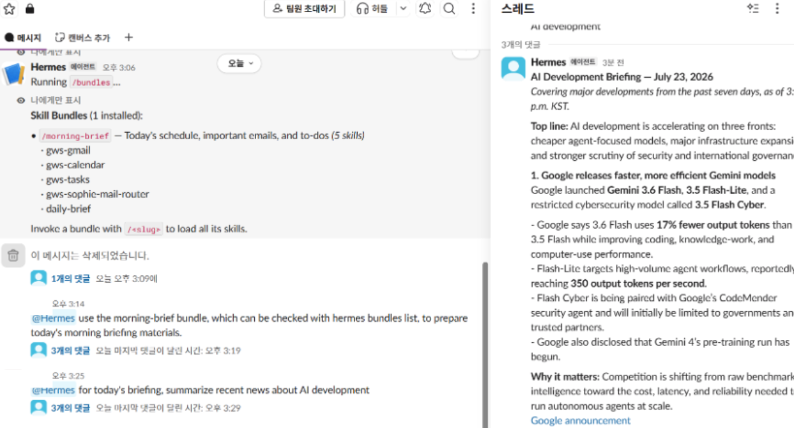

# AI-development briefing delivered through Slack

## Supported claim

The capture records:

- a reusable `morning-brief` bundle listing Gmail, Calendar, Tasks, a custom mail-routing Skill, and daily-brief logic;
- a Slack request to summarize recent AI-development news; and
- a structured briefing response returned in the Slack thread.

Together, these elements support Skill-bundle availability, request execution, and delivery through the configured work interface.

## Boundary

The image does not independently verify the factual accuracy, completeness, or freshness of every generated news statement. It also does not show mailbox access, calendar access, scheduled execution, or autonomous delegation between profiles.

For production-grade briefings, each item should retain its source URL, collection timestamp, publication date, and reviewer status. Evaluation should measure citation coverage, unsupported-claim rate, source freshness, and factual consistency.

## Sanitization

The workspace label, requester name, and requester avatars were covered with opaque masks. The message composer and lower unreviewed response content were cropped out. The remaining pixels were not generatively reconstructed.
