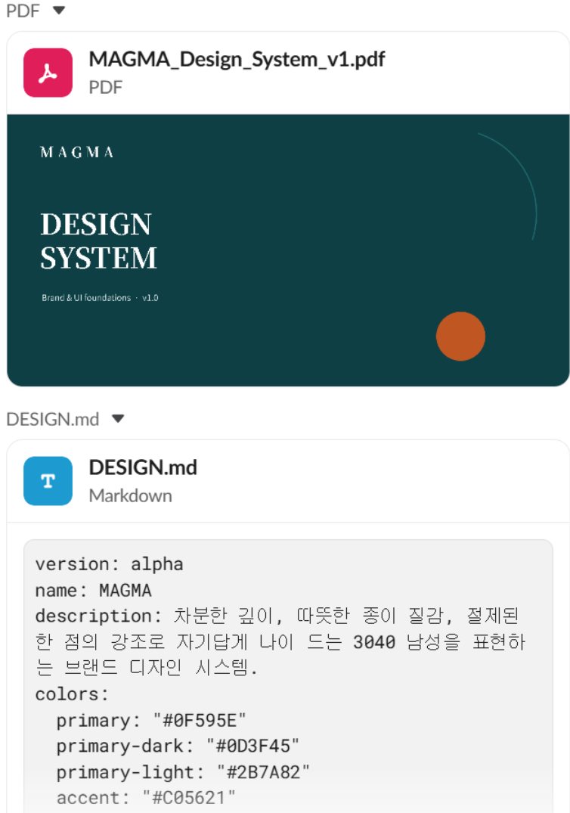

# Design-system presentation evidence

<table>
  <tr>
    <td width="52%"></td>
    <td width="48%"></td>
  </tr>
</table>

## Observed behavior

The Slack assignment directs Mia to create a Canva presentation from the profile-local `DESIGN.md` source and explicitly requires the color palette, typography, and UI components. This is a bounded deliverable contract: it names the responsible role, source artifact, target medium, and required content.

The live trace shows Mia loading `design-md`, `design-system`, `computer-use`, and `powerpoint` Skills, reading `DESIGN.md`, writing an artifact, invoking a terminal step, and checking for local presentation utilities. The adjacent result capture shows a file named `MAGMA_Design_System_v1.pdf` and a structured `DESIGN.md` preview with version, system name, narrative, and color-token fields.

## Supported claim

A human assigned the Mia profile a design-system presentation task through Slack. Mia used role-relevant Skills and the live tool surface to process a profile-local specification, and a named PDF presentation artifact was produced for review.

## Boundary

The requester reports that Canva API was called during this workflow. The published captures do not contain a Canva API request or response, HTTP status, asset identifier, export job record, or independently inspectable Canva project URL. Consequently, Canva API invocation is **Not independently verified** by this public evidence set.

The captures also do not independently prove:

- that the visible PDF was generated by the exact execution shown rather than another run;
- that a PowerPoint file was created in addition to the visible PDF;
- that every slide satisfies the source specification;
- that the typography, UI components, accessibility, and visual consistency passed formal QA;
- that the complete deck contains no private or licensed material outside the published frame.

The supported claim is intentionally limited to the visible assignment, Skill/tool trace, and resulting PDF preview.

## Sanitization

- the workflow image reuses the previously reviewed public derivative P-008 rather than publishing a duplicate frame;
- the requester's identity is normalized and personal home-path fragments are replaced in P-008;
- the generic profile-relative input path, Mia identity, Skill names, tool names, task requirements, and deliverable filename remain visible;
- the deliverable preview was re-encoded to normalize metadata, with no private identifier or credential observed in the published frame.
