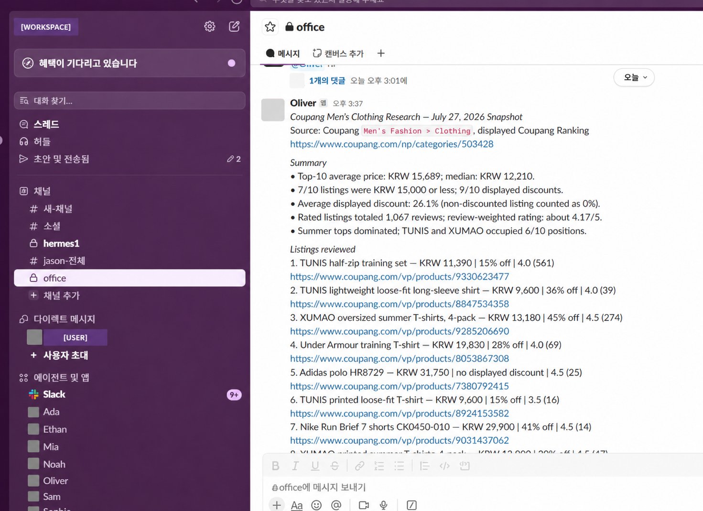

# Live workload: public-source market snapshot

Workspace and requester identity fields are covered with opaque masks. The visible business result and public source links are retained as workload evidence.

## Business question

Summarize the visible pricing, discount, rating, and review patterns in a public men's-clothing ranking so a strategy lead can decide what merits deeper research.

## Operational path

1. A human assigned the research task in the private Slack workspace.
2. The request was routed to the research/strategy profile running on Hermes in Docker.
3. The agent inspected a public ranking page through its approved data-access integration.
4. A structured result was returned to the Slack channel.

## Sanitized result

For the visible top ten listings in the captured snapshot, the agent reported:

| Metric | Reported value |
|---|---:|
| Average price | KRW 15,689 |
| Median price | KRW 12,210 |
| Listings at or below KRW 15,000 | 7 / 10 |
| Listings displaying a discount | 9 / 10 |
| Average displayed discount | 26.1% |
| Combined review count | 1,067 |
| Review-weighted rating | approximately 4.17 / 5 |
| Listings from the two most frequent brands | 6 / 10 |

The screenshot retains the visible public product URLs as source context. They can change over time and are not inputs to the deterministic public demo.

## What this evidence supports

- A specialized Hermes profile received a real work request through Slack.
- The agent used a public-source integration and returned a structured analytical result.
- The result included quantitative aggregation and explicit source context.

## What this evidence does not support

- It is not a representative estimate of the entire market.
- It does not establish causal relationships.
- It does not prove an automated cross-agent handoff; the captured live task was routed to one specialist.
- The dynamic source may no longer reproduce the same ranking.

The public synthetic demo addresses reproducibility and contract testing. The private live evidence addresses operational deployment. Neither is used to claim more than it demonstrates.
