# Obsidian-backed knowledge automation evidence

## Case objective

This live case extends the multi-agent office from conversational delivery into an artifact-first market-intelligence workflow. Public web material is retained as source-addressed Markdown, organized into reusable entities and concepts, synthesized into a decision-oriented report, reviewed through multilingual fact-checking, and delivered as a source-linked presentation.

Reader-facing English deliverable: [Men's Fashion Market in the 30s Segment](../case-studies/thirtysomething-mens-fashion-market-report.md).

Obsidian is the human review and storage surface for the Markdown vault. The OMW workflow supplies the role procedures for curation, terminology management, entity/concept linking, fact-checking, and quality review. Hermes/Oliver is the agent entry point shown in the execution trace.

## Observed workflow

```text
public source pages
  -> raw Markdown with source URI
  -> librarian workflow and duplicate suppression
  -> proposed entity / concept pages with provenance and relations
  -> evidence-linked market synthesis
  -> English and Japanese fact-check reports
  -> Korean / English / Japanese correction set
  -> 15-slide management presentation with source register
```

### 1. Source-addressed raw ingestion

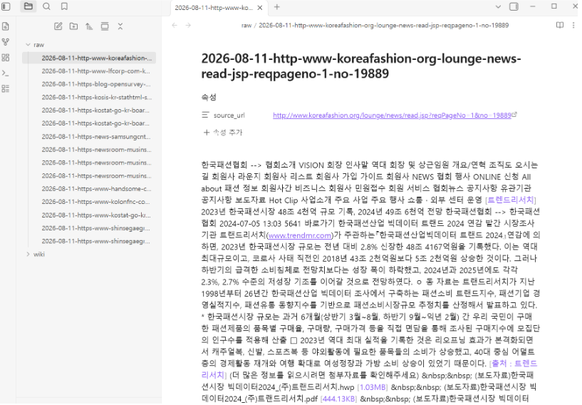

The Obsidian capture shows multiple dated raw notes and one selected page retaining its `source_uri` together with extracted source text. This establishes a file-backed research corpus rather than an answer that exists only in chat history. It does not independently verify extraction completeness, crawler legality, or the accuracy of the source content.

### 2. Librarian execution and idempotent task handling

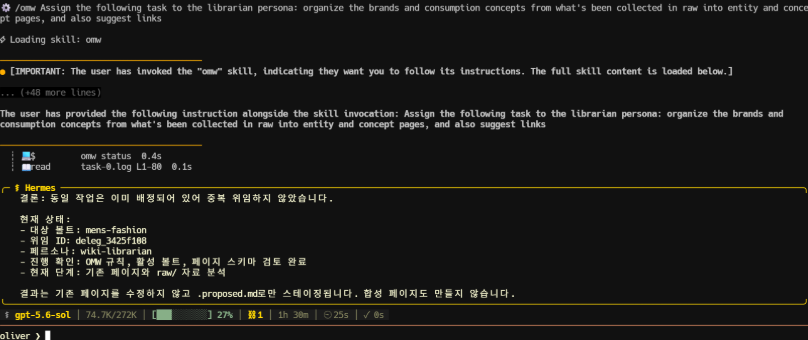

The user asks Oliver to assign the librarian persona to organize brands and consumption concepts from `raw` into entity and concept pages and to propose links. The trace reports that the same task had already been assigned, suppresses duplicate work, and summarizes the existing target and output counts: nine proposed entity pages and seven proposed concept pages. The capture supports task routing, state inspection, and duplicate suppression; it is not a complete execution log for the earlier run that created every file.

### 3. Typed concept and provenance model

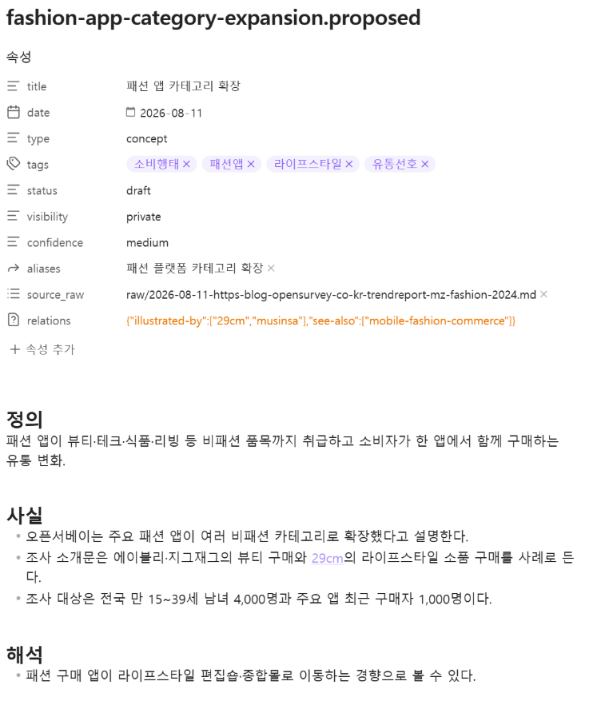

The proposed `fashion-app-category-expansion` page uses typed metadata for date, page type, tags, status, visibility, confidence, raw-source provenance, and relations. Its body separates definition, reported facts, and interpretation. This structure makes downstream review possible because an analyst can distinguish a sourced observation from an inference and can trace the page back to the raw capture.

The visible relation proposal connects the concept to `29cm`, `musinsa`, and `mobile-fashion-commerce`. A proposed link is a modeling decision, not proof of a causal relationship.

### 4. Evidence-linked synthesis

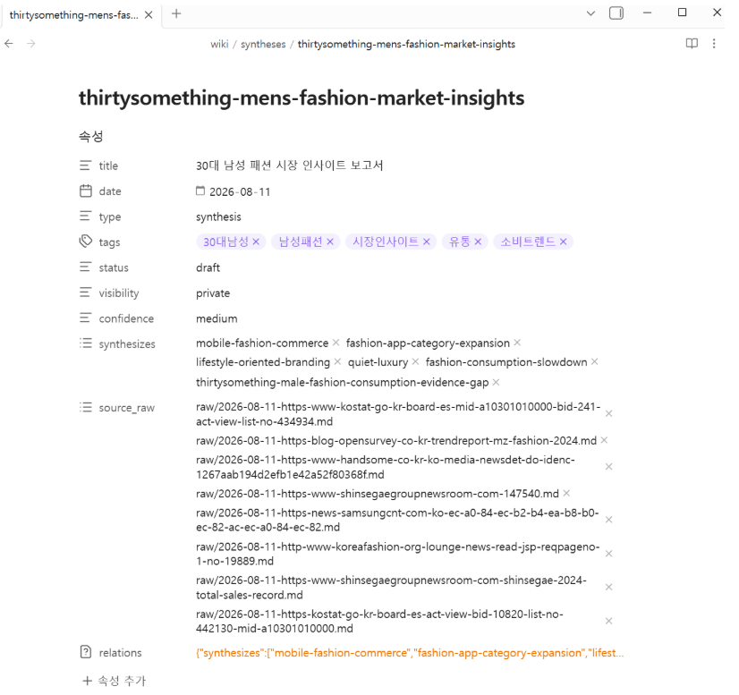

The synthesis page for the menswear market in the thirties segment references multiple concept pages and multiple raw source notes. It records `draft`, `private`, and `medium` confidence rather than presenting the analysis as finalized truth. The screen supports multi-source synthesis and explicit provenance; it does not demonstrate statistical representativeness or independent source quality by itself.

### 5. Multilingual claim review

<table>
  <tr>
    <td width="50%">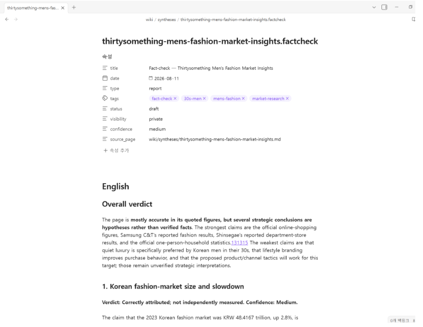</td>
    <td width="50%">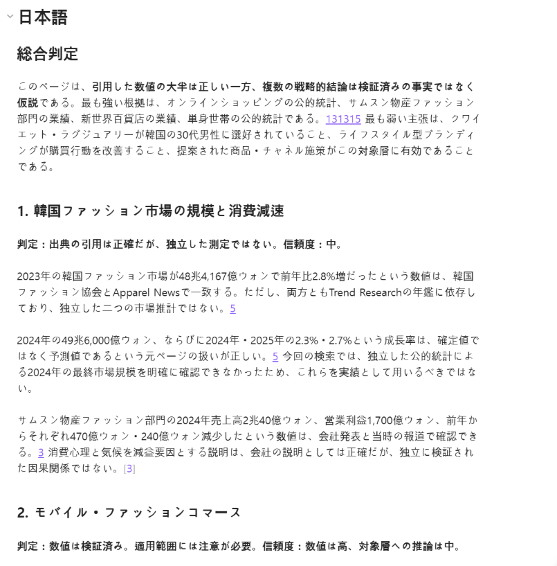</td>
  </tr>
  <tr>
    <td><strong>English review.</strong> The report distinguishes correctly attributed figures from hypotheses and states that several strategic conclusions remain unverified.</td>
    <td><strong>Japanese review.</strong> The localized report preserves verdicts, confidence, source caveats, and the distinction between a company explanation and an independently measured causal claim.</td>
  </tr>
</table>

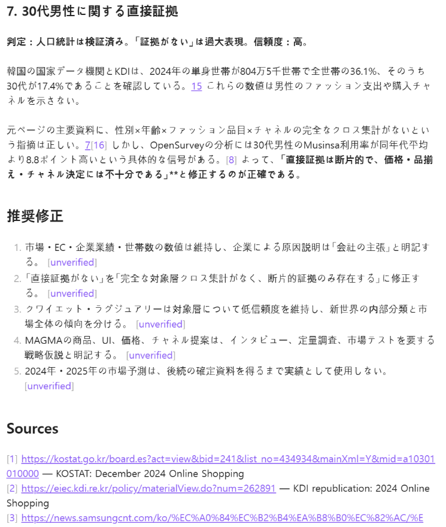

The Japanese review narrows overbroad claims, preserves verified figures, labels causal explanations as company statements, and directs the reader to the source register. This demonstrates multilingual analytical communication with uncertainty preservation rather than translation alone.

### 6. Presentation delivery and source traceability

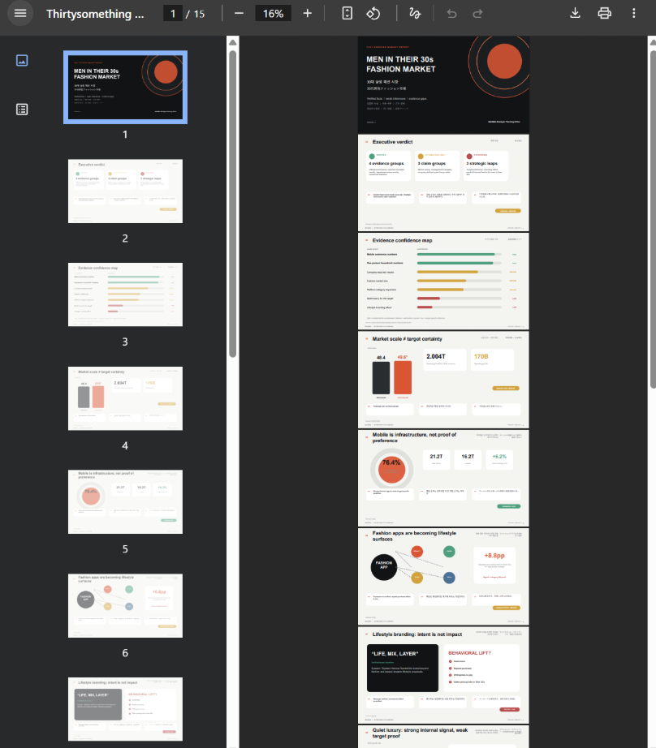

The PDF viewer shows a 15-slide market report with an executive verdict, confidence map, market-size framing, channel analysis, lifestyle-branding interpretation, and later source pages. The visible deck establishes a reviewable presentation artifact; it does not independently prove that every slide passed numerical, visual, copyright, or accessibility QA.

<table>
  <tr>
    <td width="50%">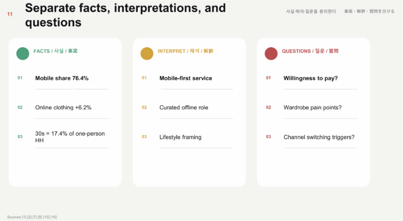</td>
    <td width="50%">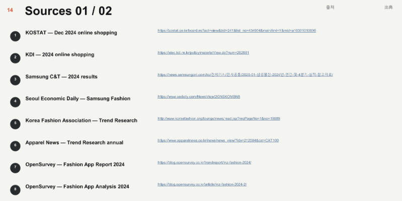</td>
  </tr>
  <tr>
    <td><strong>Decision hygiene.</strong> One slide separates facts, interpretations, and unanswered research questions.</td>
    <td><strong>Traceability.</strong> The source appendix retains named publishers and public URLs instead of hiding provenance in speaker notes.</td>
  </tr>
</table>

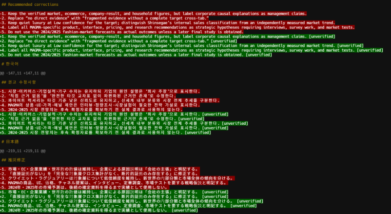

The correction output is rendered in English, Korean, and Japanese. Across languages it preserves the same control logic: keep verified figures, attribute corporate explanations, downgrade unsupported audience claims, and mark strategic proposals as hypotheses requiring interviews, surveys, or market tests.

## Role model

| OMW role | Responsibility in this case | Review control |
|---|---|---|
| Curator | Normalize raw source records and preserve provenance | Source URI remains attached to the record |
| Terminologist | Maintain reusable market and consumption concepts | Concepts are typed and confidence-scored |
| Librarian | Create entity/concept pages and propose links | Proposed status prevents automatic promotion to accepted knowledge |
| Fact-checker | Test claims against cited material | Verdict, confidence, caveat, and unresolved status are retained |
| Auditor | Identify evidence gaps and prioritize correction | Unsupported causal or audience claims remain unverified |

## Graph-analysis boundary

The workflow is designed to make the vault searchable, indexable, linkable, and auditable. A code-based graph layer can calculate clusters and bridge nodes repeatedly over the same Markdown graph, reducing reliance on an LLM's subjective full-vault reading and enabling analysis as the vault grows.

The published captures establish structured relations and synthesis links. They do **not** independently establish the clustering implementation, benchmark its determinism, or validate a discovered bridge. Those claims require executable graph-analysis code, a fixed fixture, and repeat-run metrics before they should be treated as reproduced engineering evidence.

## Supported claim

A human used the Hermes/Oliver agent entry point and the OMW role workflow to manage a file-backed market-research corpus, inspect duplicate task state, structure concepts with provenance and confidence, synthesize multiple sources, produce multilingual fact-check artifacts, and materialize a source-linked presentation for review.

## Boundaries and limitations

- The public captures are selected UI evidence, not a complete event log or forensic chain.
- The earlier run that created all proposed entity and concept files is summarized by the visible trace but not replayed in the published images.
- Public-source presence does not establish source independence, measurement quality, or permission for unrestricted reuse.
- Confidence labels are workflow metadata; they are not statistically calibrated probabilities.
- The fact-check reports improve attribution and uncertainty handling but do not replace domain-expert review.
- The 15-slide PDF is a visible deliverable; full numerical, visual, accessibility, and copyright review remains outside this evidence set.
- Obsidian and OMW are enabling tools. This repository claims ownership only of the configured workflow, agent use, evidence methodology, and portfolio documentation—not the third-party applications themselves.

## Privacy review

- No credential, email address, Slack workspace identifier, account ID, or private network address is visible in the 11 published captures.
- The supplied file-list screenshot containing a personal Windows home path was excluded in full instead of blurred.
- A redundant terminal rendering of the fact-check page was excluded because the structured report captures provide stronger and more readable evidence.
- Public URLs and generic vault-relative paths remain visible because they are required for provenance and do not identify the local account.
