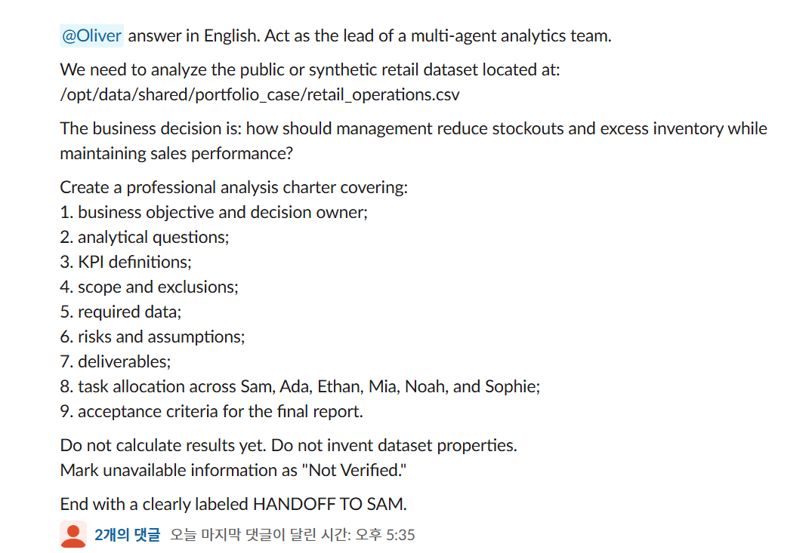
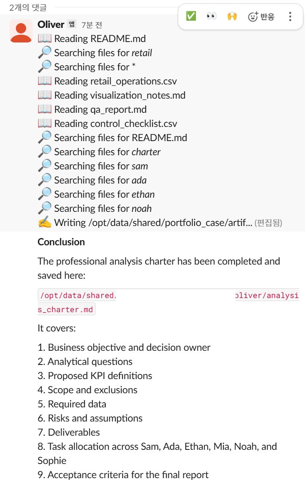

# Retail analysis charter evidence

<table>
  <tr>
    <td width="58%"></td>
    <td width="42%"></td>
  </tr>
</table>

## Observed behavior

The Slack request assigns Oliver a concrete management decision: reduce stockouts and excess inventory without sacrificing sales performance. It requires a nine-part analysis charter with decision ownership, analytical questions, KPI definitions, scope, required data, risks, deliverables, specialist allocation, and final acceptance criteria.

The prompt also imposes two evidence controls: Oliver must not invent dataset properties, and unavailable information must be labeled `Not Verified`. A named handoff to Sam is requested so the planning output can become an explicit input to the next role rather than remaining an unstructured chat response.

The result capture shows Oliver using the live file/tool surface to inspect the retail input and related project artifacts. The visible conclusion confirms that a nine-part charter was written as a named Markdown artifact in the shared project area.

## Supported claim

A human routed a bounded retail-analytics planning task to the Oliver profile through Slack. Oliver inspected file-backed project context and produced an analysis-charter artifact that covered the requested planning areas and allocated work across the named specialist roles.

## Boundary

These two screenshots do not independently prove:

- that the input dataset is public, synthetic, complete, or analytically valid;
- that the charter contents were correct beyond the visible completion summary;
- that Sam or the other specialists received or completed the requested handoff;
- autonomous agent-to-agent delegation;
- the accuracy of any downstream analysis, forecast, visualization, or QA result.

The deterministic reference pipeline and tests validate the public role contracts separately. Additional live evidence is required before claiming completion of the full specialist workflow.

## Sanitization

- the requester's display name, avatar, and timestamp are covered by opaque white masks;
- an already-redacted private path segment in the result capture is re-covered with an opaque white mask;
- the generic container path, agent identity, task text, tool trace, and artifact filename remain visible;
- no credentials, workspace identifiers, email addresses, or personal host paths are published.
